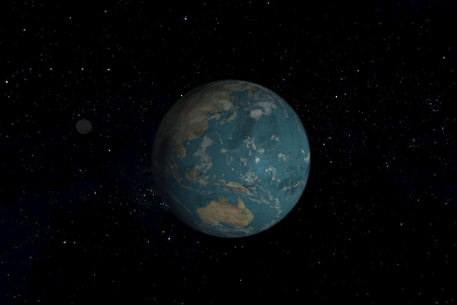

<h1 align="center">Salut, moi c'est Rémi 👋</h1>

**Étudiant à l'École 42 Angoulême, spécialisation systèmes embarqués et simulation.**
Passionné par le C, le bas niveau et la simulation physique, je vise le développement logiciel embarqué, idéalement dans le secteur spatial.

🎯 **À la recherche d'une alternance ou d'un stage en développement embarqué ou en simulation**.

---

<h2 align="center">🧑‍🚀 À propos</h2>

- 🎓 Cursus École 42 : projets en C et C++.
- 🛰️ Attiré par l'embarqué et la simulation : je développe un moteur de gravité en intégrée la lumière le long des géodésiques de l'espace-temps pour des simulations astronomiques.
- 🔧 Parcours avant le code : BTS, militaire, puis chef de chantier dans le TP.

*Aujourd'hui j'ai fait le choix de me donner un avenir dans ma passion*

---

<h2 align="center">🚀 Projets phares</h2>

| Projet | Langage | Ce que ça démontre |
|---|---|---|
| **[Space Simulator](https://github.com/Remi-cpn/Space_Simulator)** | C-GLSL | Simulation d'espace rendue par raytracing relativiste. Trous noirs, lentilles gravitationnelles et dynamique N-corps |
| **[MiniRT — Raytracer avec moteur phisique](https://github.com/Remi-cpn/miniRT)** | C | Rendu d'images par lancer de rayons, optimisation, Moteur physique N-corps orienté simulations astronomiques |
| **[IRC](https://github.com/Minipl0p/IRC/tree/dev)** | C | Systeme de chat respectant la norme IRC |
| **[Minishell](https://github.com/Remi-cpn/minishell)** | C | Interpréteur de commandes : parsing, processus, signaux, redirections |

  

---

<h2 align="center">🛠️ Compétences</h2>

### Maîtrisées

### En apprentissage

### Outils & environnement

